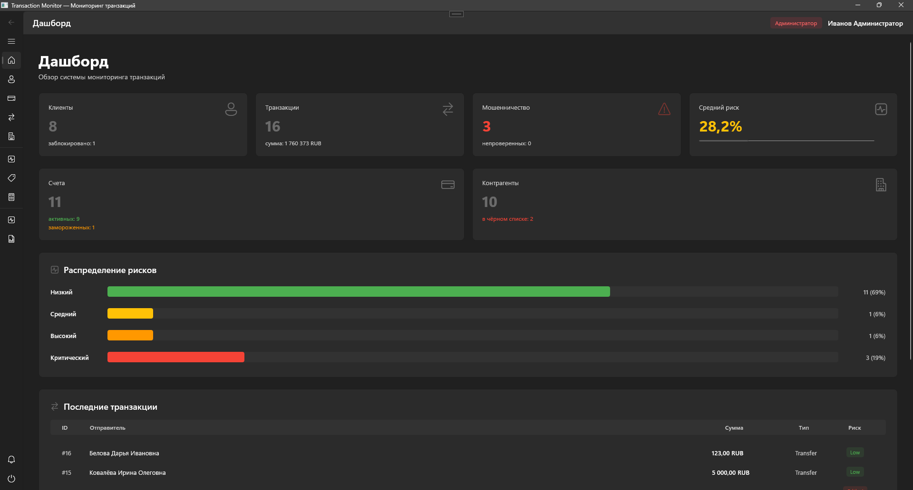
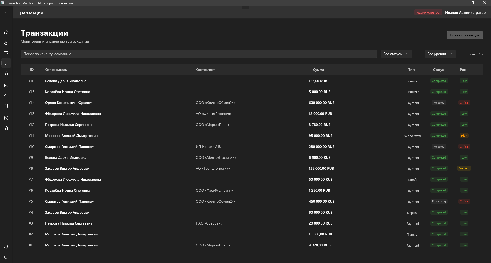
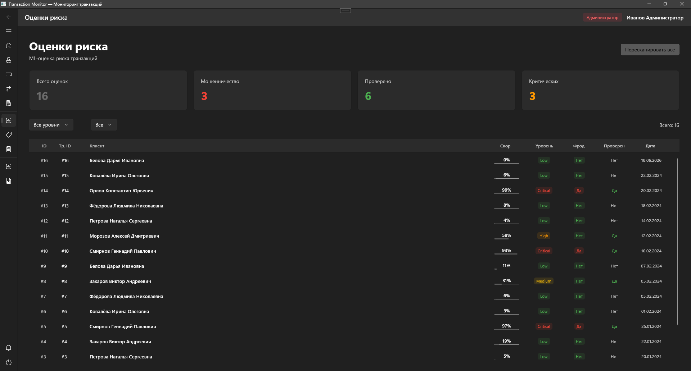

<div align="center">

# 💳 TransactionMonitor

### Transaction monitoring and risk analysis desktop application

**C# · .NET 8 · WinUI 3 · SQL Server**

Desktop application for monitoring financial transactions, calculating risk scores and analysing potentially suspicious activity.

</div>

---

## 📖 About

TransactionMonitor is a Windows desktop application for managing and analysing transaction data.

The application combines transaction monitoring with rule-based risk scoring and provides tools for working with:

- transactions;
- clients;
- accounts;
- counterparties;
- risk scores;
- risk labels;
- reports and analytics.

The project was built to explore desktop application architecture, SQL data access, risk analysis and financial transaction monitoring.

---

## ✨ Features

### 💸 Transaction Monitoring

- view transaction history;
- search transactions;
- filter by status;
- filter by risk level;
- inspect transaction details;
- create new transactions;
- automatically calculate a risk score for new transactions.

### ⚠️ Risk Analysis

Each transaction can be evaluated using several risk factors.

The system takes into account information such as:

- transaction amount;
- transaction time;
- sender account;
- counterparty;
- counterparty risk level;
- blacklist status;
- client scoring;
- blocked-client status;
- number of recent transactions.

The resulting transaction receives:

- risk score;
- risk level;
- model version;
- fraud flag.

---

## 📊 Dashboard

The dashboard provides an overview of the monitored system.

Displayed metrics include:

- total clients;
- blocked clients;
- total transactions;
- total transaction amount;
- detected fraud cases;
- average risk score;
- active and frozen accounts;
- counterparties;
- blacklisted counterparties;
- unreviewed high-risk transactions.

The dashboard also displays the distribution of transactions by risk level and recent transaction activity.

---

## 👥 Client Management

The application provides information about registered clients and their financial activity.

For each client the system can display:

- personal information;
- scoring score;
- blocking status;
- associated accounts;
- recent transactions.

---

## 🏦 Account Management

Accounts are associated with clients and contain information such as:

- account number;
- balance;
- currency;
- status;
- account type;
- opening date.

The system distinguishes between active and frozen accounts.

---

## 🤝 Counterparty Monitoring

Counterparties can have their own risk attributes.

The application stores:

- company / counterparty name;
- tax identifier;
- activity category;
- country;
- risk level;
- blacklist status.

Counterparty information is used as one of the inputs for transaction risk calculation.

---

## 🧮 Risk Scoring

When a new transaction is created, TransactionMonitor automatically builds a risk input and evaluates the transaction.

Simplified flow:

```text
New transaction
      │
      ▼
Collect transaction features
      │
      ├── Amount
      ├── Time
      ├── Client score
      ├── Client status
      ├── Counterparty risk
      ├── Blacklist status
      └── Recent activity
      │
      ▼
RiskCalculator
      │
      ▼
Risk Score
      │
      ├── Low
      ├── Medium
      ├── High
      └── Critical
      │
      ▼
Store result in SQL Server
```

The calculated result is stored separately from the original transaction data.

---

## 📑 Risk Review

Risk scores can contain information about:

- score value;
- risk level;
- scoring model version;
- scoring timestamp;
- fraud status;
- analyst review status;
- analyst comment.

This allows automated scoring to be combined with manual analyst review.

---

## 📤 Reports & Export

The project includes reporting functionality and CSV export.

This makes it possible to use transaction and monitoring data outside the application for further analysis.

---

## 🛠 Tech Stack

### Application

- C#
- .NET 8
- WinUI 3
- Windows App SDK
- XAML

### Database

- Microsoft SQL Server
- Microsoft.Data.SqlClient
- parameterized SQL queries

### UI

- WinUI 3
- CommunityToolkit
- DataGrid
- XAML pages and controls

### Data

- JSON
- CSV export

---

## 🏗 Architecture

The application separates domain models, services and user-interface pages.

```text
TransactionMonitor/
│
├── Models/
│   ├── Account.cs
│   ├── AlertItem.cs
│   ├── Client.cs
│   ├── Counterparty.cs
│   ├── DashboardStats.cs
│   ├── RiskLabel.cs
│   ├── RiskScore.cs
│   ├── Transaction.cs
│   └── User.cs
│
├── Services/
│   ├── CsvExportService.cs
│   ├── DatabaseService.cs
│   ├── RiskCalculator.cs
│   └── SessionService.cs
│
├── Views/
│   ├── AccountsPage.xaml
│   ├── ChartsPage.xaml
│   ├── ClientsPage.xaml
│   ├── CounterpartiesPage.xaml
│   ├── DashboardPage.xaml
│   ├── LoginPage.xaml
│   ├── MainShellPage.xaml
│   ├── ReportsPage.xaml
│   ├── RiskLabelsPage.xaml
│   ├── RiskScoresPage.xaml
│   └── TransactionsPage.xaml
│
├── Assets/
├── App.xaml
├── MainWindow.xaml
└── TransactionMonitor.csproj
```

### Application flow

```text
WinUI Views
     │
     ▼
Application Services
     │
     ├── DatabaseService
     ├── RiskCalculator
     ├── SessionService
     └── CsvExportService
     │
     ▼
Domain Models
     │
     ▼
SQL Server
```

---

## 🗄 Database

TransactionMonitor uses SQL Server as its primary data store.

Core entities include:

```text
Users
Clients
Accounts
Transactions
Counterparties
RiskScores
RiskLabels
```

Relationships between these entities make it possible to analyse a transaction together with information about its sender, account and counterparty.

---

## 🚀 Requirements

To run the project locally:

- Windows 10/11;
- Visual Studio 2022;
- .NET 8 SDK;
- Windows App SDK;
- SQL Server / SQL Server Express.

---

## ⚙️ Configuration

Configure the SQL Server connection before starting the application.

Do not store machine-specific credentials or server names directly in source code.

Example development connection string:

```text
Server=localhost\SQLEXPRESS;
Database=TransactionMonitoring;
Trusted_Connection=True;
TrustServerCertificate=True;
```

For local development, store the connection configuration outside the application source.

---

## ▶️ Running

Clone the repository:

```bash
git clone https://github.com/Coffee1337/TransactionMonitor.git
cd TransactionMonitor
```

Open the solution in Visual Studio.

Restore NuGet dependencies, configure the database connection and run the application.

---

## 📸 Screenshots

### Dashboard



### Transactions



### Risk Analysis


---

## 🔮 Possible Improvements

- move database configuration to application settings;
- introduce a repository/data-access layer;
- dependency injection;
- asynchronous database operations;
- automated unit tests for risk calculation;
- integration tests for data access;
- Entity Framework Core or Dapper evaluation;
- configurable risk-scoring rules;
- audit trail for analyst actions;
- structured application logging;
- database migrations;
- CI pipeline.

---

## 🎯 What This Project Demonstrates

TransactionMonitor demonstrates practical experience with:

- C# and .NET desktop development;
- WinUI 3;
- relational databases;
- SQL queries and joins;
- transaction processing;
- risk-scoring logic;
- data modelling;
- dashboard development;
- desktop UI architecture;
- separation of domain and service logic.

---

## 👨‍💻 Author

**Egor Trefilov / Coffee1337**

GitHub:  
https://github.com/Coffee1337

Portfolio:  
https://coffee1337.github.io

</div>
